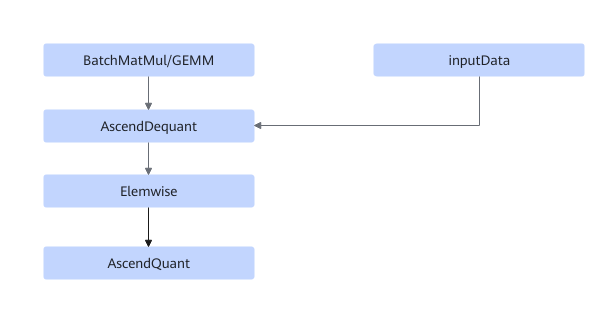
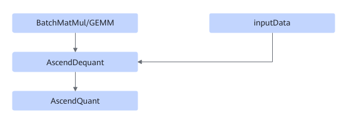

# TbeBatchMatMulQuantFusionPass

## Description

Performs UB fusion on BatchMatMul/GEMM and AscendDequant/AscendQuant/Elemwise in the subgraphs that meet the following patterns.

Pattern 1:

Mode 2:

## Constraints

- BatchMatMul can be MatMul, MatMulV2, BatchMatMul, and BatchMatMulV2.
- Dynamic shapes are not supported.
- The Elemwise node must be FastGeluV2.

## Applicable Products

<!-- npu="310b" id1 -->
Atlas 200I/500 A2 inference products
<!-- end id1 -->

<!-- npu="310p" id2 -->
Atlas inference products
<!-- end id2 -->

<!-- npu="910" id3 -->
Atlas training products
<!-- end id3 -->
