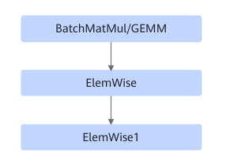
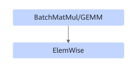
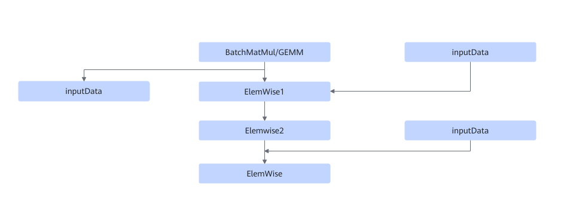

# TbeBatchMatmulElementWiseFusionPass

## Description

Performs UB fusion on BatchMatMul/GEMM and ElemWise in the subgraphs that meet the following patterns.

Pattern 1:

Pattern 2:

Pattern 3:

## Constraints

- Dynamic shapes are not supported.
- In pattern 1, Elemwise supports only FusedMulAdd, Add, Div, RealDiv, Relu, and ReluGrad, while Elemwise1 supports only Add, Relu, and FusedMulAdd.
- In pattern 2, Elemwise supports only FusedMulAdd, Add, Div, RealDiv, Relu, and ReluGrad.
- In pattern 3, Elemwise supports only Mul, Elemwise1 supports only Mul, and Elemwise2 supports only Sigmoid.
- BatchMatMul can be replaced by BatchMatMulV2.

## Applicable Products

<!-- npu="310b" id1 -->
Atlas 200I/500 A2 inference products
<!-- end id1 -->

<!-- npu="310p" id2 -->
Atlas inference products
<!-- end id2 -->

<!-- npu="910" id3 -->
Atlas training products
<!-- end id3 -->
