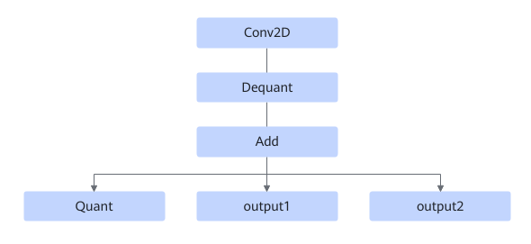

# TbeConv2DAddMulQuantPass

## Description

Performs UB fusion on Conv2D+Dequant+Add+Quant.

## Constraints

When the other two output nodes of the Add operator are of MaxPoolV3 type, fusion is not supported.

When the Add operator is converted to the Fixpipe operator, fusion is not supported.

## Applicable Products

<!-- npu="310b" id1 -->
Atlas 200I/500 A2 inference products
<!-- end id1 -->

<!-- npu="310p" id2 -->
Atlas inference products
<!-- end id2 -->

<!-- npu="910" id3 -->
Atlas training products
<!-- end id3 -->
