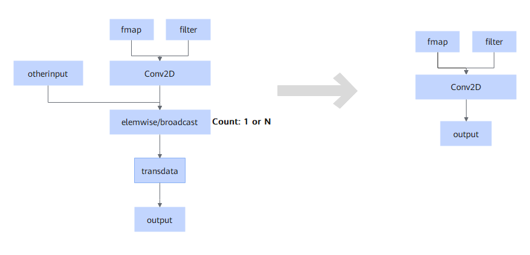

# TbeConv2DAddRealDivTransdataFusionPass

## Description

Performs UB fusion on the Conv2D, elemwise/broadcast, and transdata nodes. The `elemwise` trustlist is Add/Div/Realdiv. Only the single-output cascade structure in the SDXL network is supported, that is, conv2d transdata, conv2d+add+transdata, conv2d+div+transdata, conv2d+realdiv+transdata, conv2d+add+div+transdata, and conv2d+add+realdiv+transdata in static scenarios.

## Constraints

- The following scenarios are supported: Conv2D with group = 1 and fp16 input and output; Conv2D with 5HD input and output, and fused operator with 5HD input and NCHW output. Conv2D supports only the original NCHW input format.
- The elemwise node supports only dual inputs and single output.
- The conv2d node cannot be connected to stridedread. Otherwise, fusion cannot be performed.
- The static trustlist of the elemwise node must be add/div/realdiv. Otherwise, fusion cannot be performed.
- The number of elemwise nodes is 1 ≤ *N* ≤ 2. When *N* = 2, the first elemwise cannot be multi-reference output. Otherwise, it is not fused.
- When the second input of the RealDiv node meets the following three conditions, the operator is converted into a MUL operator and is not fused.

    - The type is Const/Constant.
    - The data type is float32.
    - The value is less than -1e-6 or greater than 1e-6.

    In the ONNX model, the Div nodes in the graph are converted into RealDiv nodes. If the preceding conditions are met, the nodes are not fused.

- Only part of the trustlist of conv2d specifications on the SDXL network is supported. For details, see the following.

    Note: The value of `dilation` must be `{1, 1, 1, 1}`. Different `pad_mode` values affect the actual `pad` values involved in computation. The `pad` values here are those required for computation after different `pad_mode` values are configured.

    - \{\{"x", \{1, 1536, 16, 16\}\}, \{"filter", \{1536, 1536, 3, 3\}\}, \{"pads", \{1, 1, 1, 1\}\}, \{"strides", \{1, 1, 1, 1\}\}\},
    - \{\{"x", \{1, 4, 128, 128\}\}, \{"filter", \{320, 4, 3, 3\}\}, \{"pads", \{1, 1, 1, 1\}\}, \{"strides", \{1, 1, 1, 1\}\}\},
    - \{\{"x", \{1, 320, 128, 128\}\}, \{"filter", \{320, 320, 3, 3\}\}, \{"pads", \{1, 1, 1, 1\}\}, \{"strides", \{1, 1, 2, 2\}\}\},
    - \{\{"x", \{1, 640, 64, 64\}\}, \{"filter", \{640, 640, 3, 3\}\}, \{"pads", \{1, 1, 1, 1\}\}, \{"strides", \{1, 1, 1, 1\}\}\},
    - \{\{"x", \{1, 1280, 32, 32\}\}, \{"filter", \{1280, 1280, 3, 3\}\}, \{"pads", \{1, 1, 1, 1\}\}, \{"strides", \{1, 1, 1, 1\}\}\},
    - \{\{"x", \{1, 1280, 64, 64\}\}, \{"filter", \{1280, 1280, 3, 3\}\}, \{"pads", \{1, 1, 1, 1\}\}, \{"strides", \{1, 1, 1, 1\}\}\},
    - \{\{"x", \{1, 640, 128, 128\}\}, \{"filter", \{640, 640, 3, 3\}\}, \{"pads", \{1, 1, 1, 1\}\}, \{"strides", \{1, 1, 1, 1\}\}\},
    - \{\{"x", \{1, 320, 128, 128\}\}, \{"filter", \{320, 320, 3, 3\}\}, \{"pads", \{1, 1, 1, 1\}\}, \{"strides", \{1, 1, 1, 1\}\}\},
    - \{\{"x", \{1, 4, 128, 128\}\}, \{"filter", \{384, 4, 3, 3\}\}, \{"pads", \{1, 1, 1, 1\}\}, \{"strides", \{1, 1, 1, 1\}\}\},
    - \{\{"x", \{1, 384, 128, 128\}\}, \{"filter", \{384, 384, 3, 3\}\}, \{"pads", \{1, 1, 1, 1\}\}, \{"strides", \{1, 1, 2, 2\}\}\},
    - \{\{"x", \{1, 1536, 64, 64\}\}, \{"filter", \{1536, 1536, 3, 3\}\}, \{"pads", \{1, 1, 1, 1\}\}, \{"strides", \{1, 1, 1, 1\}\}\},
    - \{\{"x", \{1, 768, 128, 128\}\}, \{"filter", \{768, 768, 3, 3\}\}, \{"pads", \{1, 1, 1, 1\}\}, \{"strides", \{1, 1, 1, 1\}\}\},
    - \{\{"x", \{1, 384, 128, 128\}\}, \{"filter", \{384, 384, 3, 3\}\}, \{"pads", \{1, 1, 1, 1\}\}, \{"strides", \{1, 1, 1, 1\}\}\},
    - \{\{"x", \{1, 320, 64, 64\}\}, \{"filter", \{640, 320, 3, 3\}\}, \{"pads", \{1, 1, 1, 1\}\}, \{"strides", \{1, 1, 1, 1\}\}\},
    - \{\{"x", \{1, 320, 64, 64\}\}, \{"filter", \{640, 320, 1, 1\}\}, \{"pads", \{0, 0, 0, 0\}\}, \{"strides", \{1, 1, 1, 1\}\}\},
    - \{\{"x", \{1, 640, 32, 32\}\}, \{"filter", \{1280, 640, 1, 1\}\}, \{"pads", \{0, 0, 0, 0\}\}, \{"strides", \{1, 1, 1, 1\}\}\},
    - \{\{"x", \{1, 2560, 32, 32\}\}, \{"filter", \{1280, 2560, 3, 3\}\}, \{"pads", \{1, 1, 1, 1\}\}, \{"strides", \{1, 1, 1, 1\}\}\},
    - \{\{"x", \{1, 2560, 32, 32\}\}, \{"filter", \{1280, 2560, 1, 1\}\}, \{"pads", \{0, 0, 0, 0\}\}, \{"strides", \{1, 1, 1, 1\}\}\},
    - \{\{"x", \{1, 1920, 32, 32\}\}, \{"filter", \{1280, 1920, 3, 3\}\}, \{"pads", \{1, 1, 1, 1\}\}, \{"strides", \{1, 1, 1, 1\}\}\},
    - \{\{"x", \{1, 1920, 32, 32\}\}, \{"filter", \{1280, 1920, 1, 1\}\}, \{"pads", \{0, 0, 0, 0\}\}, \{"strides", \{1, 1, 1, 1\}\}\},
    - \{\{"x", \{1, 1920, 64, 64\}\}, \{"filter", \{640, 1920, 3, 3\}\}, \{"pads", \{1, 1, 1, 1\}\}, \{"strides", \{1, 1, 1, 1\}\}\},
    - \{\{"x", \{1, 1920, 64, 64\}\}, \{"filter", \{640, 1920, 1, 1\}\}, \{"pads", \{0, 0, 0, 0\}\}, \{"strides", \{1, 1, 1, 1\}\}\},
    - \{\{"x", \{1, 1280, 64, 64\}\}, \{"filter", \{640, 1280, 1, 1\}\}, \{"pads", \{0, 0, 0, 0\}\}, \{"strides", \{1, 1, 1, 1\}\}\},
    - \{\{"x", \{1, 960, 64, 64\}\}, \{"filter", \{640, 960, 3, 3\}\}, \{"pads", \{1, 1, 1, 1\}\}, \{"strides", \{1, 1, 1, 1\}\}\},
    - \{\{"x", \{1, 960, 64, 64\}\}, \{"filter", \{640, 960, 1, 1\}\}, \{"pads", \{0, 0, 0, 0\}\}, \{"strides", \{1, 1, 1, 1\}\}\},
    - \{\{"x", \{1, 960, 128, 128\}\}, \{"filter", \{320, 960, 3, 3\}\}, \{"pads", \{1, 1, 1, 1\}\}, \{"strides", \{1, 1, 1, 1\}\}\},
    - \{\{"x", \{1, 960, 128, 128\}\}, \{"filter", \{320, 960, 1, 1\}\}, \{"pads", \{0, 0, 0, 0\}\}, \{"strides", \{1, 1, 1, 1\}\}\},
    - \{\{"x", \{1, 640, 128, 128\}\}, \{"filter", \{320, 640, 3, 3\}\}, \{"pads", \{1, 1, 1, 1\}\}, \{"strides", \{1, 1, 1, 1\}\}\},
    - \{\{"x", \{1, 640, 128, 128\}\}, \{"filter", \{320, 640, 1, 1\}\}, \{"pads", \{0, 0, 0, 0\}\}, \{"strides", \{1, 1, 1, 1\}\}\},
    - \{\{"x", \{1, 384, 64, 64\}\}, \{"filter", \{768, 384, 3, 3\}\}, \{"pads", \{1, 1, 1, 1\}\}, \{"strides", \{1, 1, 1, 1\}\}\},
    - \{\{"x", \{1, 384, 64, 64\}\}, \{"filter", \{768, 384, 1, 1\}\}, \{"pads", \{0, 0, 0, 0\}\}, \{"strides", \{1, 1, 1, 1\}\}\},
    - \{\{"x", \{1, 768, 32, 32\}\}, \{"filter", \{1536, 768, 3, 3\}\}, \{"pads", \{1, 1, 1, 1\}\}, \{"strides", \{1, 1, 1, 1\}\}\},
    - \{\{"x", \{1, 768, 32, 32\}\}, \{"filter", \{1536, 768, 1, 1\}\}, \{"pads", \{0, 0, 0, 0\}\}, \{"strides", \{1, 1, 1, 1\}\}\},
    - \{\{"x", \{1, 3072, 16, 16\}\}, \{"filter", \{1536, 3072, 1, 1\}\}, \{"pads", \{0, 0, 0, 0\}\}, \{"strides", \{1, 1, 1, 1\}\}\},
    - \{\{"x", \{1, 3072, 32, 32\}\}, \{"filter", \{1536, 3072, 3, 3\}\}, \{"pads", \{1, 1, 1, 1\}\}, \{"strides", \{1, 1, 1, 1\}\}\},
    - \{\{"x", \{1, 3072, 32, 32\}\}, \{"filter", \{1536, 3072, 1, 1\}\}, \{"pads", \{0, 0, 0, 0\}\}, \{"strides", \{1, 1, 1, 1\}\}\},
    - \{\{"x", \{1, 2304, 32, 32\}\}, \{"filter", \{1536, 2304, 1, 1\}\}, \{"pads", \{0, 0, 0, 0\}\}, \{"strides", \{1, 1, 1, 1\}\}\},
    - \{\{"x", \{1, 2304, 64, 64\}\}, \{"filter", \{768, 2304, 3, 3\}\}, \{"pads", \{1, 1, 1, 1\}\}, \{"strides", \{1, 1, 1, 1\}\}\},
    - \{\{"x", \{1, 2304, 64, 64\}\}, \{"filter", \{768, 2304, 1, 1\}\}, \{"pads", \{0, 0, 0, 0\}\}, \{"strides", \{1, 1, 1, 1\}\}\},
    - \{\{"x", \{1, 1536, 64, 64\}\}, \{"filter", \{768, 1536, 3, 3\}\}, \{"pads", \{1, 1, 1, 1\}\}, \{"strides", \{1, 1, 1, 1\}\}\},
    - \{\{"x", \{1, 1536, 64, 64\}\}, \{"filter", \{768, 1536, 1, 1\}\}, \{"pads", \{0, 0, 0, 0\}\}, \{"strides", \{1, 1, 1, 1\}\}\},
    - \{\{"x", \{1, 1152, 64, 64\}\}, \{"filter", \{768, 1152, 3, 3\}\}, \{"pads", \{1, 1, 1, 1\}\}, \{"strides", \{1, 1, 1, 1\}\}\},
    - \{\{"x", \{1, 1152, 64, 64\}\}, \{"filter", \{768, 1152, 1, 1\}\}, \{"pads", \{0, 0, 0, 0\}\}, \{"strides", \{1, 1, 1, 1\}\}\},
    - \{\{"x", \{1, 1152, 128, 128\}\}, \{"filter", \{384, 1152, 3, 3\}\}, \{"pads", \{1, 1, 1, 1\}\}, \{"strides", \{1, 1, 1, 1\}\}\},
    - \{\{"x", \{1, 1152, 128, 128\}\}, \{"filter", \{384, 1152, 1, 1\}\}, \{"pads", \{0, 0, 0, 0\}\}, \{"strides", \{1, 1, 1, 1\}\}\},
    - \{\{"x", \{1, 768, 128, 128\}\}, \{"filter", \{384, 768, 3, 3\}\}, \{"pads", \{1, 1, 1, 1\}\}, \{"strides", \{1, 1, 1, 1\}\}\},
    - \{\{"x", \{1, 768, 128, 128\}\}, \{"filter", \{384, 768, 1, 1\}\}, \{"pads", \{0, 0, 0, 0\}\}, \{"strides", \{1, 1, 1, 1\}\}\}

## Applicable Products

<!-- npu="310p" id1 -->
Atlas inference accelerator cards
<!-- end id1 -->
