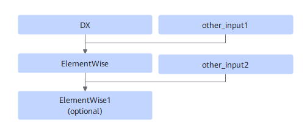

# TbeConv2DBackpropElemwiseFusionPass

## Description

Performs UB fusion on DX+ElementWise+ElementWise1 (optional).

## Constraints

- If only ElementWise exists, ReluGradV2 is supported. If ElementWise1 exists, ElementWise supports AddN and Add, and ElementWise1 supports ReluGradV2.
- DX supports Conv2DBackpropInputD, Conv2DTransposeD, and Deconvolution.
- DX supports only non-FP32 types.
- This UB fusion pattern applies to DX non-quantization use cases.
