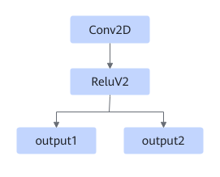

# TbeConv2DReluv2Pass

## Description

Fuses the Conv2D+ReluV2 operators into one Conv2D operator.

## Constraints

- The data type of output 1 of Conv2D must be float16.
- ReluV2 must have two outputs.

## Applicable Products

<!-- npu="910" id1 -->
Atlas training products
<!-- end id1 -->
