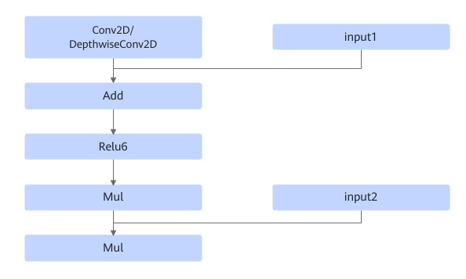
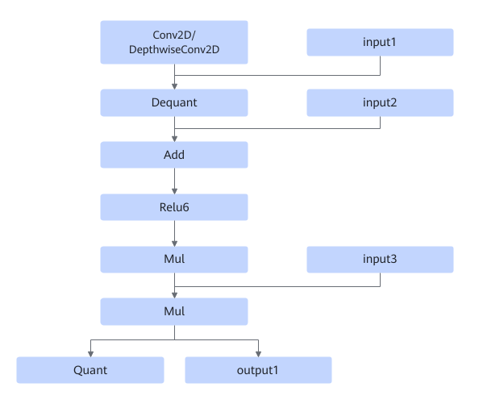

# TbeConv2dAddRelu6MulMulFusionPass

## Description

Two fusion patterns are supported:

Fuses Conv2D/DepthwiseConv2D+Add+Relu6+Mul+Mul into one operator.

Fuses Conv2D/DepthwiseConv2D+Dequant+Add+Relu6+Mul+Mul+Quant into one operator.

## Constraints

None

## Applicable Products

<!-- npu="310b" id1 -->
Atlas 200I/500 A2 inference products
<!-- end id1 -->

<!-- npu="310p" id2 -->
Atlas inference products
<!-- end id2 -->

<!-- npu="910" id3 -->
Atlas training products
<!-- end id3 -->
