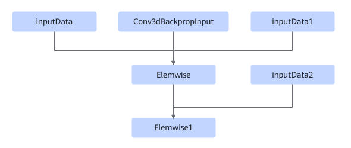
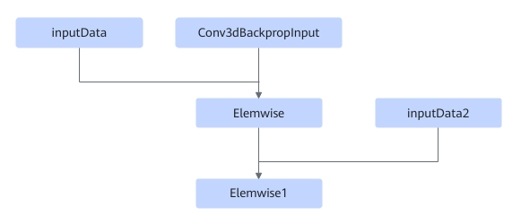
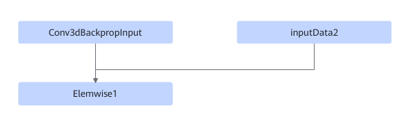

# TbeConv3dDxElemwisePass

## Description

Performs UB fusion on Conv3dBackpropInput and Elemwise in the following pattern subgraphs.

Or

Or

## Constraints

- Elemwise can only be set to AddN, and Elemwise1 can only be set to LeakyReluGrad.
- Dynamic shapes are not supported.

## Applicable Products

<!-- npu="310p" id1 -->
Atlas inference products
<!-- end id1 -->

<!-- npu="910" id2 -->
Atlas training products
<!-- end id2 -->
