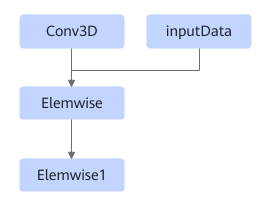
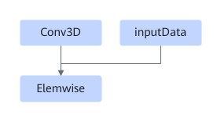
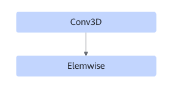
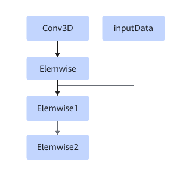

# TbeConv3dElemwisePass

## Description

Performs UB fusion on Conv3D and Elemwise in a subgraph that meets the following patterns.

Or

Or

Or

## Constraints

Dynamic shapes are not supported.

Four patterns are supported, corresponding to the scenarios shown in the preceding four figures.

1. Fuses two Elemwise operators. The first operator supports only Add, and the second operator supports only ReLU.
2. Fuses an Elemwise operator that has another input. The Elemwise operator type is not restricted. AscendDequant and AscendRequant are supported.
3. Fuses an Elemwise operator that has only one input. Only ReLU is supported..
4. Fuses three Elemwise operators. The first operator supports only AscendDequant, the second supports only Add, and the third supports only ReLU. This scenario supports only Atlas inference products.

## Applicable Products

<!-- npu="310p" id1 -->
Atlas inference products
<!-- end id1 -->

<!-- npu="910" id2 -->
Atlas training products
<!-- end id2 -->
