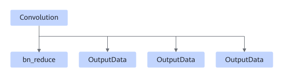
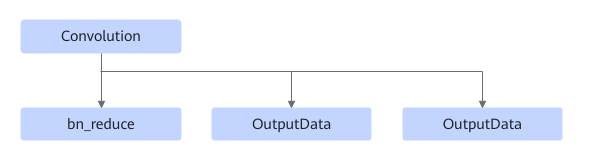

# TbeConvBnreduceFusionPass

## Description

Performs UB fusion on the Convolution+bn_reduce nodes in the subgraphs that meet the following patterns.

Or

## Constraints

The input and output data types of convolution must be fp16.

Fusion is canceled if the minimum Tiling is provided and L1 still cannot accommodate FeatureMap.

## Applicable Products

<!-- npu="310b" id1 -->
Atlas 200I/500 A2 inference products
<!-- end id1 -->

<!-- npu="310p" id2 -->
Atlas inference products
<!-- end id2 -->

<!-- npu="910" id3 -->
Atlas training products
<!-- end id3 -->

<!-- npu="910b" id4 -->
Atlas A2 training products/Atlas A2 inference products
<!-- end id4 -->

<!-- npu="A3" id5 -->
Atlas A3 training products/Atlas A3 inference products
<!-- end id5 -->
