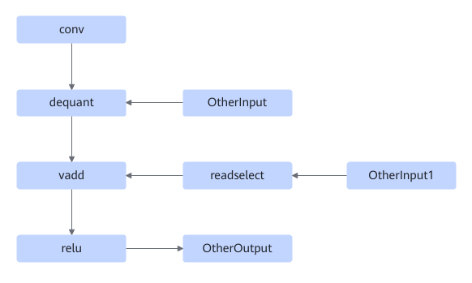
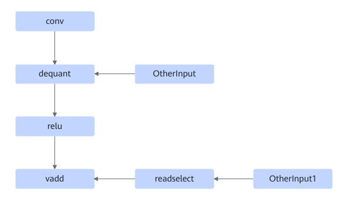
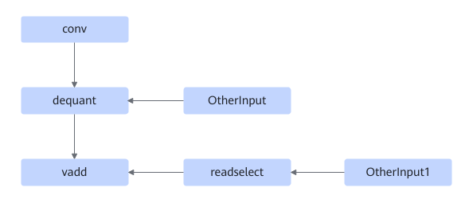

# TbeConvDequantVaddReluFusionPass

## Description

Fuses the operators into one Conv2D fusion operator in the following three modes:

Or

Or

## Constraints

The ReLU node does not support PReLU.

## Applicable Products

<!-- npu="310p" id1 -->
Atlas inference products
<!-- end id1 -->

<!-- npu="910" id2 -->
Atlas training products
<!-- end id2 -->
