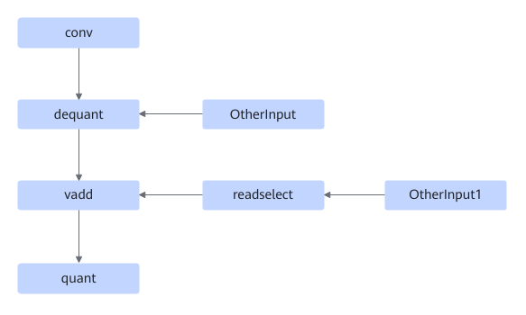
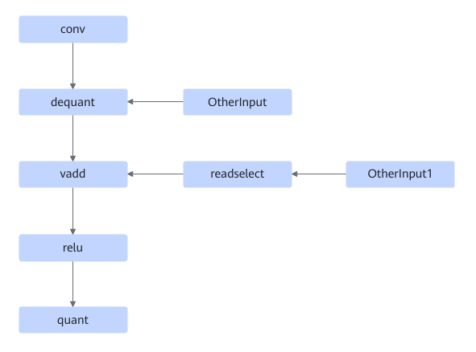
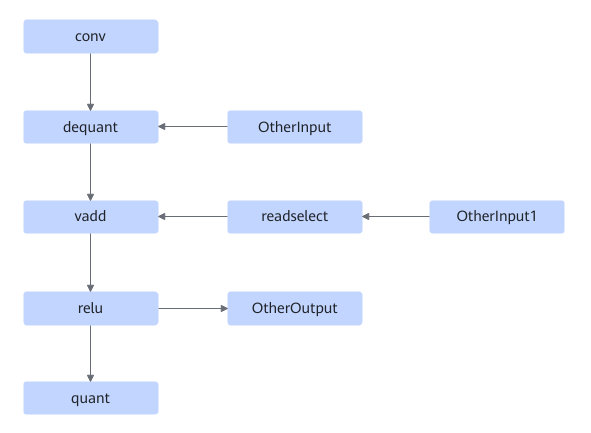
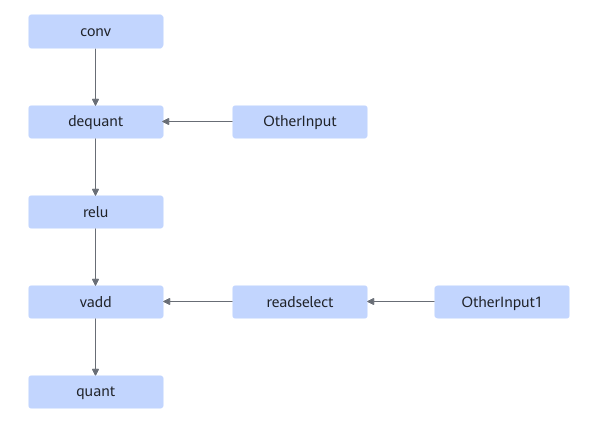
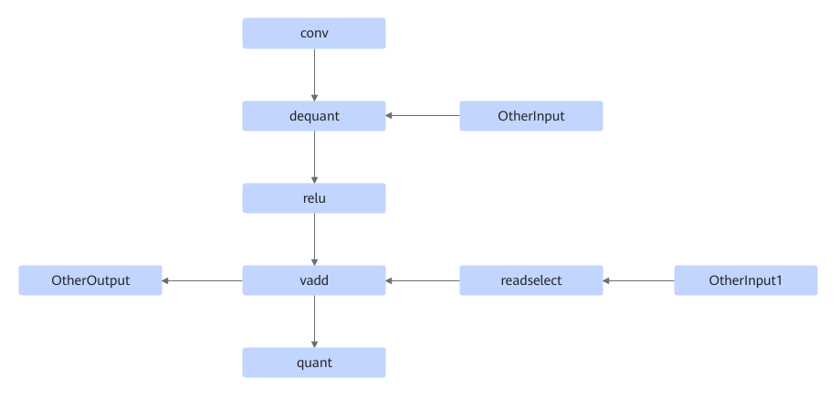
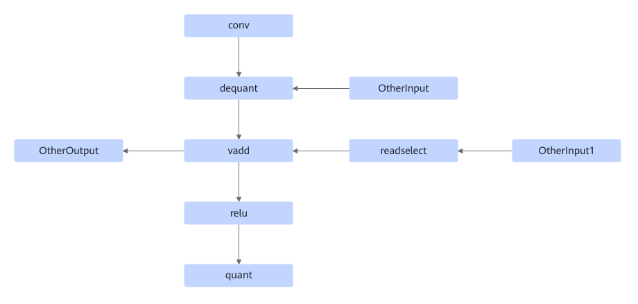
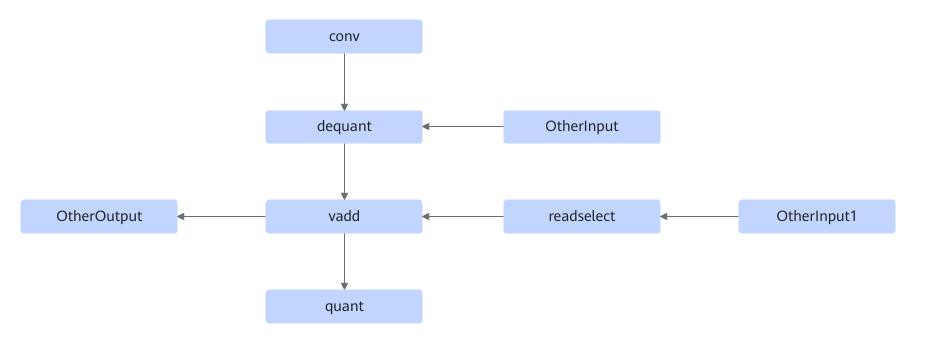

# TbeConvDequantVaddReluQuantFusionPass

## Description

Fuses the operators into one conv2d fusion operator in the following seven patterns:

Or

Or

Or

Or

Or

Or

## Constraints

- The vadd node must be an Add operator.
- The readselect operator node is not required in the following scenarios:
    - The nodes matched by the fusion pass contain the ReLU node.
    - When multiple Conv+Dequant nodes exist and the Cin of a Conv is greater than that of the matched Conv node, the Conv+Dequant node with a larger Cin is matched.

## Applicable Products

<!-- npu="310p" id1 -->
Atlas inference products
<!-- end id1 -->

<!-- npu="910" id2 -->
Atlas training products
<!-- end id2 -->
