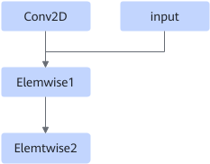

# TbeConvDoubleInFusionPass

## Description

Fuses the Conv2D+Elemwise+Elemwise operators into one Conv2D operator.

## Constraints

Currently, the nodes support only the NCHW, NHWC and HWCN formats.

The fused Elemwise2 operator supports only one input from Elemwise1.

## Applicable Products

<!-- npu="310b" id1 -->
Atlas 200I/500 A2 inference products
<!-- end id1 -->

<!-- npu="310p" id2 -->
Atlas inference products
<!-- end id2 -->

<!-- npu="910" id3 -->
Atlas training products
<!-- end id3 -->
