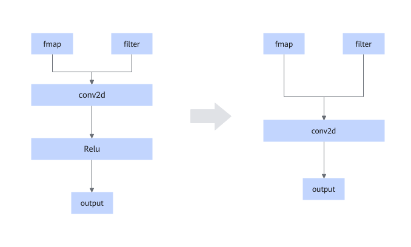

# TbeConvFixPipeFusionPass 

## Description

Performs UB fusion on Conv2d and the Fixpipe node, Elemwise operator (optional), and Quant operator (optional) generated in [FIXPIPEFUSIONPASS](../Graph_Fusion_Patterns/FIXPIPEFUSIONPASS.md).

## Constraints

None

## Applicable Products

<!-- npu="310b" id1 -->
Atlas 200I/500 A2 inference products
<!-- end id1 -->

<!-- npu="910b" id2 -->
Atlas A2 training products/Atlas A2 inference products
<!-- end id2 -->

<!-- npu="A3" id3 -->
Atlas A3 training products/Atlas A3 inference products
<!-- end id3 -->
