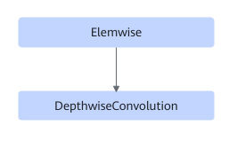

# TbeDepthwiseConvElemwiseFusionPass

## Description

Performs UB fusion on Elemwise+DepthwiseConvolution in the following pattern.

## Constraints

- The ElementWise type supports only LeakyRelu, and the coefficient is 0.
- The DepthwiseConvolution type supports only DepthwiseConv2D.

## Applicable Products

<!-- npu="310p" id1 -->
Atlas inference products
<!-- end id1 -->

<!-- npu="910" id2 -->
Atlas training products
<!-- end id2 -->
