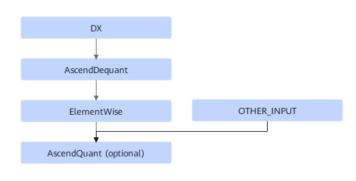

# TbeDxDeqElemQuantPass

## Description

Performs UB fusion on DX+AscendDequant+ElementWise+AscendQuant (optional).

## Constraints

- ElementWise supports Relu, LeakyRelu, and Prelu.
- DX supports Conv2DBackpropInputD, Conv2DTransposeD, and Deconvolution.
- When AscendQuant exists, ElementWise and AscendQuant dual outputs are also supported.
- Dynamic scenarios are not supported.
- This UB fusion pattern applies to DX quantization use cases.

## Applicable Products

Atlas inference products

Atlas 200I/500 A2 inference products

Atlas training products
