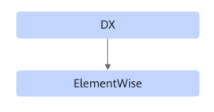

# TbeDxElemwisePass

## Description

Performs UB fusion on DX+ElementWise.

## Constraints

- ElementWise supports ReLU, Leaky ReLU, PReLU, and Add.
- DX supports Conv2DBackpropInputD, Conv2DTransposeD, and Deconvolution.
- This UB fusion pattern applies to DX non-quantization use cases, mostly for ElementWise.
- Dynamic scenarios are not supported.

## Applicable Products

<!-- npu="310p" id1 -->
Atlas inference products
<!-- end id1 -->

<!-- npu="310b" id2 -->
Atlas 200I/500 A2 inference products
<!-- end id2 -->

<!-- npu="910" id3 -->
Atlas training products
<!-- end id3 -->
