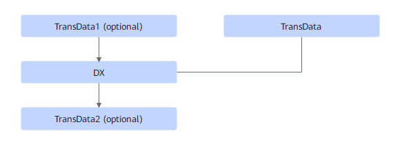

# TbeDxTransdataFusionPass

## Description

Performs UB fusion on TransData (optional)+TransData+DX+TransData (optional).

## Constraints

This fusion pattern applies only when `DX` is `Conv2DBackpropInput`, `groups` is `1`, and `dilations` is `{1,1,1,1}`.

This UB fusion pattern applies to non-quantization use cases.

The input format of TransData1 is NC1HWC0, and the output format is NCHW or NHWC.

The input format of TransData2 is NCHW or NHWC, and the output format is NC1HWC0.

## Applicable Products

<!-- npu="310p" id1 -->
Atlas inference products
<!-- end id1 -->

<!-- npu="310b" id2 -->
Atlas 200I/500 A2 inference products
<!-- end id2 -->

<!-- npu="910" id3 -->
Atlas training products
<!-- end id3 -->
