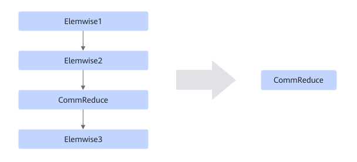
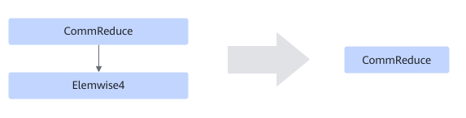

# TbeDynamicElemwiseReduceFusionPass

## Description

Performs UB fusion on the subgraphs that meet the following patterns with dynamic shapes.

Pattern 1:

Pattern 2:

## Constraints

**For pattern 1:**

- Only dynamic scenarios are supported.
- Elemwise1 is required and its quantity is 1.
- CommReduce is required and its quantity is 1.
- The Elemwise2 and Elemwise3 operators are optional. Their counts may be zero, but if present, each type must not exceed five.
- Elemwise2 and Elemwise3 cannot be multi-input nodes.

**For pattern 2:**

- Only dynamic scenarios are supported.
- CommReduce is required and its quantity is 1.
- The number of Elemwise4 ranges from 1 to 5.
- Elemwise4 cannot be a multi-input node.
