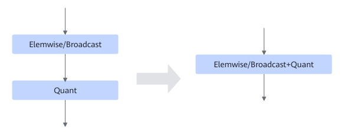

# TbeElemwiseQuantFusionPass

## Description

Performs UB fusion on the Elemwise/Broadcast and Quant operators.

## Constraints

- The Elemwise/Broadcast operator type cannot be Eltwise.
- The Elemwise/Broadcast operator must have dual inputs.
- Dynamic shapes are not supported.
