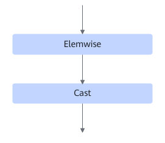
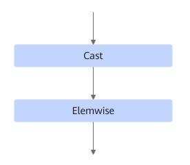
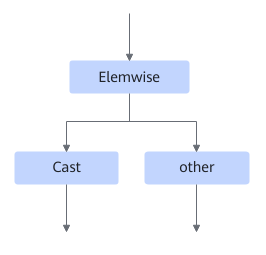
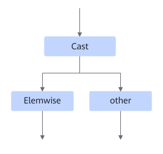

# TbeEltwiseCastFusionPass

## Description

Fuses the Elemwise and Cast operators in the following four scenarios:

Scenario 1:

Scenario 2:

Scenario 3

Scenario 4:

## Constraints

- The Cast operator must be float16-to-float32 or float32-to-float16.
- The Elemwise operator type can be "Relu", "Add", "Mul", or "Sqrt".
- The `other` operator can be matched only. It cannot be involved in the fusion.
- Dynamic shapes are not supported.
