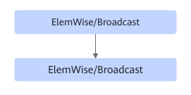

# TbeEltwiseFusionPass

## Description

Performs UB fusion on the ElemWise/Broadcast nodes in the subgraphs that meet the following pattern. A maximum of six consecutive ElemWise/Broadcast nodes are supported.

## Constraints

Dynamic shapes are not supported.

## Applicable Products

<!-- npu="310b" id1 -->
Atlas 200I/500 A2 inference products
<!-- end id1 -->

<!-- npu="310p" id2 -->
Atlas inference products
<!-- end id2 -->

<!-- npu="910" id3 -->
Atlas training products
<!-- end id3 -->

<!-- npu="A3" id4 -->
Atlas A3 training products/Atlas A3 inference products
<!-- end id4 -->
