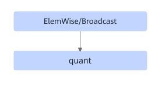
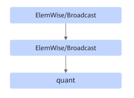
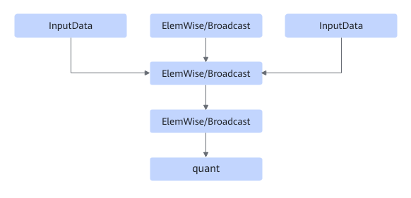

# TbeEltwiseQuantFusionPass

## Description

Performs UB fusion on the ElemWise/Broadcast and quant nodes in the subgraphs that meet the following patterns.

Or

Or

## Constraints

- In an ElemWise/Broadcast+ElemWise/Broadcast+Quant use case, a maximum of five ElemWise/Broadcast nodes are supported.
- Dynamic shapes are not supported.
