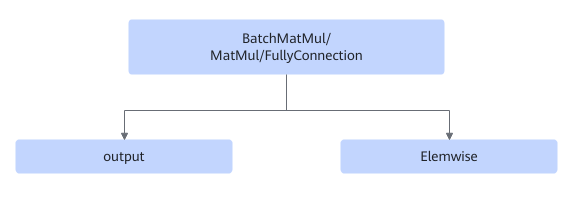
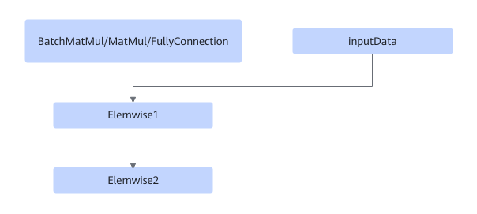
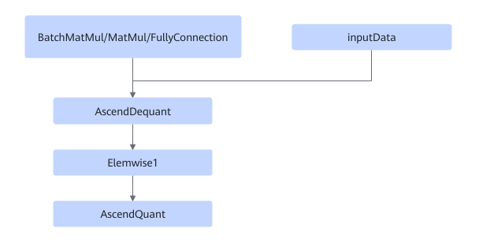
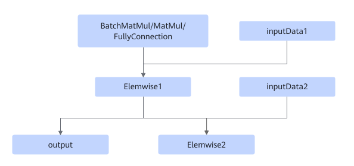
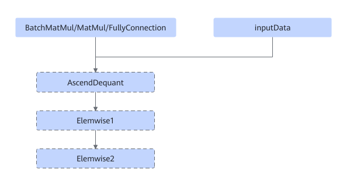

# TbeFullyconnectionElemwiseDequantFusionPass

## Description

Performs UB fusion on the FullyConnection/MatMul/MatMulV2/BatchMatMul/BatchMatMulV2+ElemWise+AscendQuant+AscendDequant nodes in the subgraphs that meet the following patterns.

The dotted boxes in the fifth pattern indicate that these nodes may not be matched.

Or

Or

Or

Or

## Constraints

- The ElemWise2 node supports only Elu, LeakyRelu, Gelu, Softsign, Relu6, Relu, Softplus, Sigmoid, Tanh, Selu, GeluGrad, Add, AddN, FastGelu, FastGeluV2, FastGeluGrad, Eltwise, PRelu, Mul, Muls, Power, Relu6D, and TanhGrad.
- Dynamic shapes are not supported.
- For Matmul, Dequant, GELU, and Quant operators, the ElemWise1 node must be a GELU node, and the data type must be fp32.
- If ElemWise2 is not empty, ElemWise1 must be ReLU, Leaky ReLU, Add, Muls, or AddN, and ElemWise2 must be Relu6.
    - When ElemWise1 is Add, the input node of Add must be 2, the output node must be 1, and the previous node must be FullyConnection.
    - When ElemWise1 is Leaky ReLU, `negative_slope` is required and its absolute value must be greater than `1.19209e-07`.

- MatMul+ElemWise1 cannot be AddN or Mul.
- For BatchMatMul/BatchMatMulV2, ElemWise2 cannot be Add or Relu.
- When elemwise_node type is add, the output shape of fc cannot be smaller than the input shape of add.

## Applicable Products

<!-- npu="310b" id1 -->
Atlas 200I/500 A2 inference products
<!-- end id1 -->

<!-- npu="310p" id2 -->
Atlas inference products
<!-- end id2 -->

<!-- npu="910" id3 -->
Atlas training products
<!-- end id3 -->
