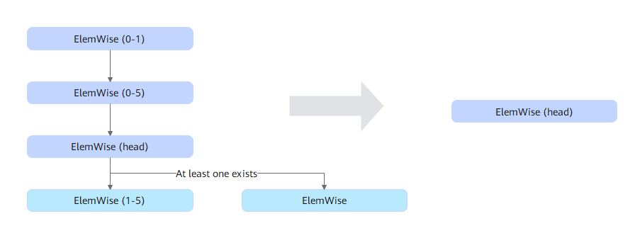
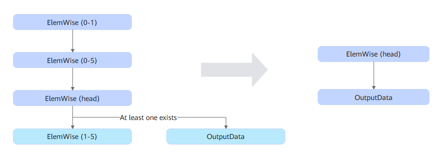

# TbeMultiOutputFusionPass

## Description

Performs UB fusion on the ElemWise nodes in the subgraphs that meet the following patterns.

The number in the parentheses indicates the value range of the number of ElemWise nodes. `head` indicates that the current node is the first node for matching.

Or

## Constraints

None
