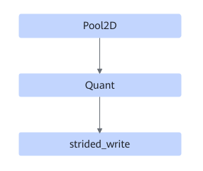

# TbePool2dQuantFusionPass

## Description

Fuses the Pool2D+Quant+strided_write operators into one operator.

## Constraints

The strided_write operator will be optimized during fusion. Therefore, the fusion pattern must not be disabled separately.

## Applicable Products

<!-- npu="310p" id1 -->
Atlas inference products
<!-- end id1 -->

<!-- npu="910b" id2 -->
Atlas A2 training products/Atlas A2 inference products
<!-- end id2 -->

<!-- npu="A3" id3 -->
Atlas A3 training products/Atlas A3 inference products
<!-- end id3 -->
