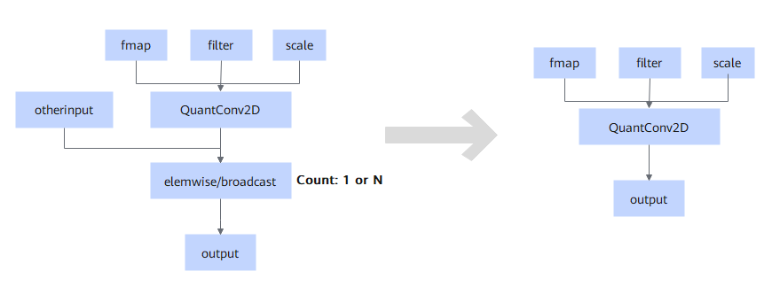

# TbeQuantConv2DElemWiseFusionPass

## Description

Performs UB fusion on the QuantConv2D and Elemwise/Broadcast nodes. The Elemwise trustlist is Add/Div/Realdiv.

## Constraints

- Only the cascading structures involved in the SD2.1 and SDXL networks are supported, that is, QuantConv2D+Add, QuantConv2D+Add Div, and QuantConv2D+Add+Realdiv in static scenarios.
- Only the static scenarios of Atlas inference products are supported.
- The QuantConv2D node is not fused if it has `offset` configured and `group` greater than 1, runs in DMA use cases, or runs with N x 1.
- Elemwise supports only dual inputs and single output, and the static trustlist must be Add/Div/Realdiv. Otherwise, fusion is not performed.
- The number of elemwise nodes is 1≤ *N* ≤ 2. When *N* = 2, the first elemwise cannot be multi-reference output. Otherwise, it is not fused.

## Applicable Products

<!-- npu="310p" id1 -->
Atlas inference products
<!-- end id1 -->
