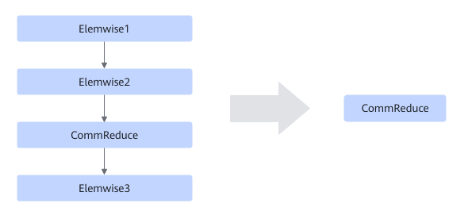
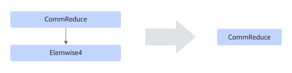

# TbeReduceElemwiseFusionPass

## Description

Performs UB fusion in a subgraph that meets the following patterns with a static shape.

Pattern 1:

Pattern 2:

## Constraints

- When this fusion pattern is used for operators with a large number of compute instructions (such as cos and sin), the compilation time may be too long. In this case, you are advised to disable this fusion pattern.
- **For pattern 1:**
    - Only static scenarios are supported.
    - Elemwise1 is required and its quantity is 1.
    - CommReduce is required and its quantity is 1.
    - Elemwise2 and Elemwise3 are optional. Their counts may be zero, but if present, each type must not exceed five.
    - Elemwise2 and Elemwise3 cannot be multi-input nodes.

- **For pattern 2:**
    - Only static scenarios are supported.
    - CommReduce is required and its quantity is 1.
    - The number of Elemwise4 ranges from 1 to 5.
    - Elemwise4 cannot be a multi-input node.
