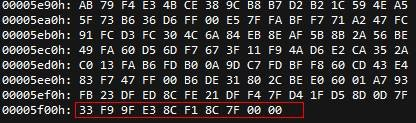

# JPEGD Decoding Failure

## Symptom

The JPEGD module fails to decode the stream. The following error messages are recorded in the log:

Log message \(1\)

```text
just support jpeg with YUV 444 422 420 400
do not support progressive mode
do not support arithmetic code, support huffman code only
```

Log message \(2\)

```text
EOI segment of the stream is invalid
```

## Possible Cause

The possible causes are as follows:

1. The data format is not supported.

    JPEGD supports only Huffman coding \(color space: YUV, subsample: 444/422/420/400\), but does not support arithmetic coding, progressive coding, or JPEG 2000 format.

2. Image data is incomplete.

## Solution

To rectify the fault, perform the following steps:

1. Use third-party software to decode images in formats that are not supported currently.
2. If the image data is incomplete, use third-party software to check the binary file of the source image based on the error message.

    For example, if the error message "EOI segment of the stream is invalid" or "EOI segment of the stream is invalid, it should be FFD9. Try software decoding." is displayed, the end of image \(EOI\) is missing. The corresponding binary image is similar to that shown in the following figure. A normal JPEG image should end with FF D9. The FF D9 marker is missing in the data.

    If the source image data is incomplete, an error message is displayed. In this case, replace the data.

    

3. If the source image data is complete, the data may be damaged during transmission. Before calling image encoding, save the stream transmitted to JPEGD by using the  **fwrite\(\)**  function and compare the stream with the source image in binary format. If they are inconsistent, data loss occurs during the transmission, and it needs your further checking.
