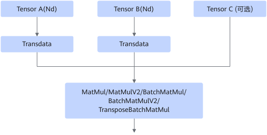
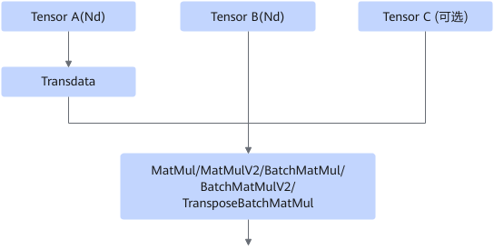
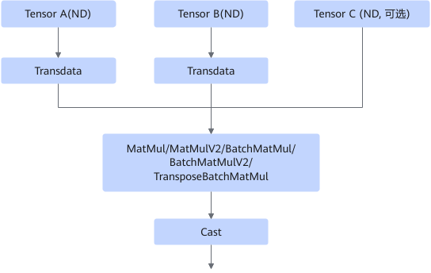

# AAMatMulNzToNdFusionPass

## 融合模式

该融合规则用于减少如下4个场景中的TransData或Cast算子。其中，TensorC节点是可选的。

- **场景1：**

融合成

- **场景2：**

融合成

- **场景3：**

融合成

- **场景4：**

融合成

## 使用约束

- 不支持TensorA和TensorB都为静态shape且非16对齐的场景。
- 场景1中，输出节点TransData算子的输入与输出格式应当分别为Fractal\_Nz和Nd；其他场景中，MatMul算子的输出格式应为Fractal\_Nz。
- 场景1、2、4中，TensorB之后的TransData算子的输入和输出数量应当都为1，并且其输入与输出格式应当分别为Nd和Fractal\_Nz。
- 作为输出节点的算子，其输出数量应当为1，MatMul类算子的输出数量应当为1。
- TensorA之后的TransData算子的输入和输出数量应当都为1，并且其输入与输出格式应当分别为Nd和Fractal\_Nz。
- 节点TensorA和TensorB的算子类型应为Data，输出数量应当为1。
- 输出节点的输出数据节点的算子类型应为NetOutput。
- TensorA和TensorB对应的两个MatMul类算子输入的数据类型应为float16。
- 场景2中，MatMul类算子的输出数据类型应当为float32；场景1、3、4中，MatMul类算子的输出数据类型应当为float16。
- 场景3、4中，Cast算子的输出数据类型应当为float32。
