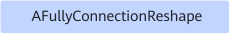

# AFullyConnectionReshapePass

## 融合模式

该融合规则将FullyConnection+Reshape算子融合为AFullyConnectionReshape算子。

融合成

## 使用约束

- Reshape的输出节点不能多于1。
- FullyConnection节点必须有axis属性，且属性值必须为1。
- Reshape第0轴的输入输出维度必须相等且输出维度不能为0。
