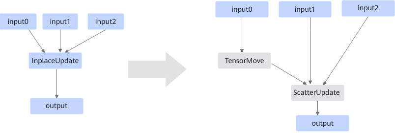

# AInplaceUpdateFusionPass

## 融合模式

该图融合就是将网络中的InplaceUpdate算子拆分成TensorMove+ScatterUpdate算子。

## 使用约束

网络中存在InplaceUpdate算子。

## 支持的型号

<!-- npu="310b" id1 -->
Atlas 200I/500 A2 推理产品
<!-- end id1 -->

<!-- npu="310p" id2 -->
Atlas 推理系列产品
<!-- end id2 -->

<!-- npu="910" id3 -->
Atlas 训练系列产品
<!-- end id3 -->

<!-- npu="910b" id4 -->
Atlas A2 训练系列产品/Atlas A2 推理系列产品
<!-- end id4 -->

<!-- npu="A3" id5 -->
Atlas A3 训练系列产品/Atlas A3 推理系列产品
<!-- end id5 -->

<!-- npu="950" id6 -->
Ascend 950PR/Ascend 950DT
<!-- end id6 -->
