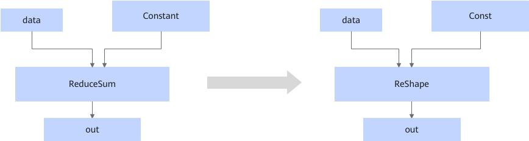

# AReduceSumFusionPass

## 融合模式

静态场景下，该融合将符合图融合pattern的ReduceSum算子修改为Reshape算子。

## 使用约束

- 动态场景下，该融合规则不生效。
- 轴不是空tensor，轴大小没有超过输入维度的范围，且输入shape中入参axis指定的轴为1。
- 该融合不可关闭。

## 支持的型号

<!-- npu="910b" id1 -->
Atlas A2 训练系列产品/Atlas A2 推理系列产品
<!-- end id1 -->
