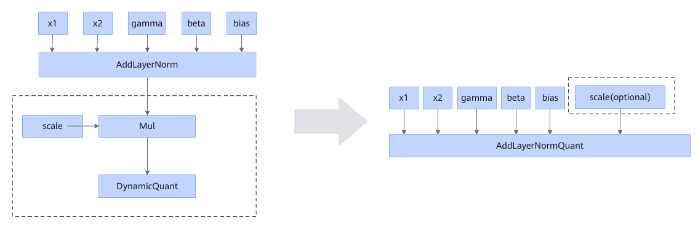

# AddLayerNormDynamicQuantFusionPass

## 融合模式

将AddLayerNorm和其下游的1个或2个DynamicQuant融合成AddLayerNormQuant算子，如下图所示：

虚线框中的结构可以是一个或者两个。

当DynamicQuant的smooth这个可选输入存在时，其会被放在AddLayerNormQuant对应的scale输入的位置。

DynamicQuant的smooth操作也可以使用Mul表达，这种情况下，DynamicQuant本身的smooth可选输入需要为空：

## 使用约束

- dtype约束
  <!-- npu="950" id3 -->
  - Ascend 950PR/Ascend 950DT场景下，AddLayerNorm的x1数据类型支持fp16、bf16、fp32。
  <!-- end id3 -->
  <!-- npu="910b" id4 -->
  - Atlas A2 训练系列产品/Atlas A2 推理系列产品场景下，AddLayerNorm的x1数据类型支持fp16、bf16。
  <!-- end id4 -->
  - AddLayerNorm的其他输入x2、gamma、beta、bias的dtype须与x1一致。
  - DynamicQuant的输入x须与 AddLayerNorm的x1数据类型一致。
  <!-- npu="950" id5 -->
  - Ascend 950PR/Ascend 950DT场景下，DynamicQuant如存在smooth参数，smooth的dtype须与AddLayerNorm的x1数据类型一致。

  <!-- end id5 -->
- 图结构约束
  - AddLayerNorm的0号输出只有1个或2个，且连接到Mul节点或DynamicQuant节点。
  - 当AddLayerNorm的0号输出有2个时，2个下游节点必须同时为Mul或同时为DynamicQuant。
  - 当AddLayerNorm的0号输出下游节点为Mul时，Mul下游有且仅有1个DynamicQuant节点，且该DynamicQuant节点不能有smooth这个可选输入。

## 支持的型号

<!-- npu="910b" id1 -->
Atlas A2 训练系列产品/Atlas A2 推理系列产品
<!-- end id1 -->

<!-- npu="950" id2 -->
Ascend 950PR/Ascend 950DT
<!-- end id2 -->
