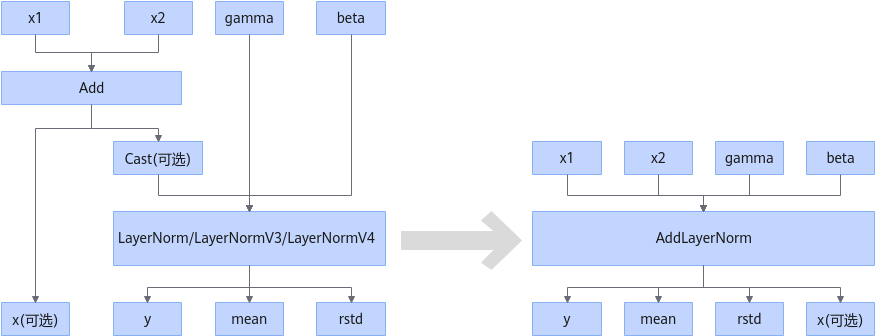
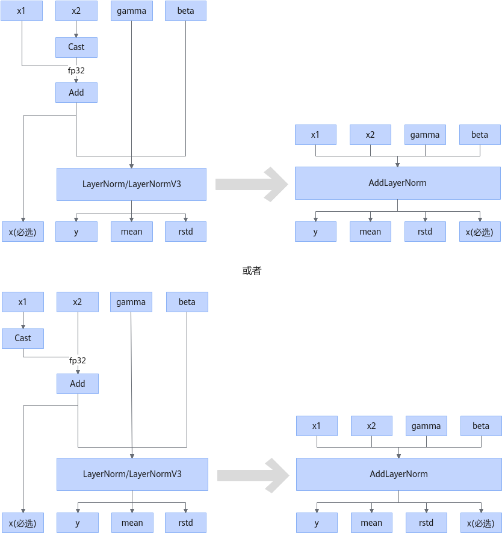

# AddLayerNormFusionPass

## 融合模式

- 场景一：基础场景，将Add + Cast\(可选\)+ LayerNorm/LayerNormV3/LayerNormV4融合为AddLayerNorm算子。
  

  

- 场景二：支持将Add + Add + Cast\(可选\)+ LayerNorm/LayerNormV3/LayerNormV4融合为AddLayerNorm算子。

  

  

- 场景三：支持将Cast + Add + LayerNorm/LayerNormV3/LayerNormV4融合为AddLayerNorm算子。

  

  

- 场景四：支持将Add + Add + Cast + LayerNorm/LayerNormV3/LayerNormV4 + Cast融合为AddLayerNorm算子。

  

  或者

  

## 使用约束

- 数据类型约束：
  - 场景一只支持如下输入数据类型组合：

   |x1|x2|gamma|beta|
   |:-:|:-:|:-:|:-:|
   |FLOAT16|FLOAT16|FLOAT16|FLOAT16|
   |BFLOAT16|BFLOAT16|BFLOAT16|BFLOAT16|
   |FLOAT16|FLOAT16|FLOAT32|FLOAT32|
   |BFLOAT16|BFLOAT16|FLOAT32|FLOAT32|
   |FLOAT16|FLOAT16|BFLOAT16|BFLOAT16|
   |BFLOAT16|BFLOAT16|FLOAT16|FLOAT16|

  - 场景二只支持如下输入数据类型组合：

   |x1|x2|gamma|beta|bias（可选）|
   |:-:|:-:|:-:|:-:|:-:|
   |FLOAT16|FLOAT16|FLOAT16|FLOAT16|FLOAT16|
   |BFLOAT16|BFLOAT16|BFLOAT16|BFLOAT16|BFLOAT16|
   |FLOAT16|FLOAT16|FLOAT32|FLOAT32|FLOAT16|
   |BFLOAT16|BFLOAT16|FLOAT32|FLOAT32|BFLOAT16|
   |FLOAT16|FLOAT16|BFLOAT16|BFLOAT16|FLOAT16|
   |BFLOAT16|BFLOAT16|FLOAT16|FLOAT16|BFLOAT16|

  - 场景三只支持如下输入数据类型组合：

   |x1|x2|gamma|beta|
   |:-:|:-:|:-:|:-:|
   |FLOAT16|FLOAT32|FLOAT32|FLOAT32|
   |FLOAT16|FLOAT32|FLOAT16|FLOAT16|
   |FLOAT16|FLOAT32|BFLOAT16|BFLOAT16|
   |FLOAT32|FLOAT16|FLOAT32|FLOAT32|
   |FLOAT32|FLOAT16|FLOAT16|FLOAT16|
   |FLOAT32|FLOAT16|BFLOAT16|BFLOAT16|
   |BFLOAT16|FLOAT32|FLOAT32|FLOAT32|
   |BFLOAT16|FLOAT32|FLOAT16|FLOAT16|
   |BFLOAT16|FLOAT32|BFLOAT16|BFLOAT16|
   |FLOAT32|BFLOAT16|FLOAT32|FLOAT32|
   |FLOAT32|BFLOAT16|FLOAT16|FLOAT16|
   |FLOAT32|BFLOAT16|BFLOAT16|BFLOAT16|

  - 场景四支持的数据类型约束：
    - x1、x2、bias的数据类型需要保持一致，且只支持FLOAT16、BFLOAT16。
    - gamma、beta的数据类型需要保持一致，且只支持FLOAT32。

  - 其他数据类型约束：

    训练场景下，不支持输入x1或x2的数据类型为FLOAT16。

- shape约束：
  - 输入x1和x2必须有相同shape。
  - 输入gamma和beta的shape必须为1维，并且shape取值和x1、x2输入shape的尾轴相同，即：gamma.shape = beta.shape = \[x1.shape\[-1\]\]
  - 场景四时，x1、x2、bias的shape最后一维保持一致。

- Cast算子和Add算子的约束：
  - 如果融合模式为场景三，Cast算子的输出类型必须是FLOAT32，且Add算子后必须有x输出。
  - 如果融合模式为场景四，如果融合前不输出output\_x2时，那么融合后的不执行Cast算子。

- 对于精度的影响：

  当融合模式为场景一或者场景二，且LayerNorm和Add之间存在Cast场景。

  如果Cast输入类型为FLOAT16/BFLOAT16，输出类型为FLOAT32时，使用此融合规则AddLayerNorm输出y的数据类型为FLOAT16/BFLOAT16，相比融合前存在精度降低的情况。

- 场景四仅训练场景下，融合前支持LayerNormV3或者LayerNormV4。

## 支持的型号

<!-- npu="910b" id1 -->
Atlas A2 训练系列产品/Atlas A2 推理系列产品
<!-- end id1 -->

<!-- npu="950" id2 -->
Ascend 950PR/Ascend 950DT
<!-- end id2 -->
