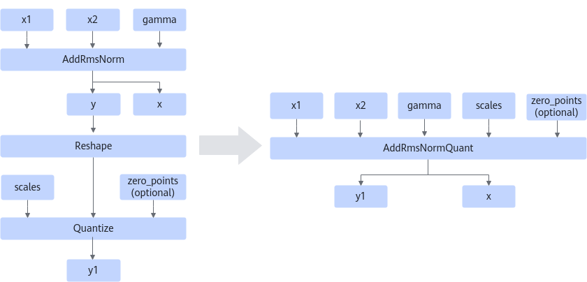

# AddRmsNormQuantFusionPass

## 融合模式

将满足如下Pattern的结构融合成AddRmsNormQuant算子。

场景一：该融合将符合图融合pattern的AddRmsNorm算子和Quantize算子融合成融合算子AddRmsNormQuant，其中AddRmsNorm算子的输出y作为Quantize算子的第一个输入。

场景二：该融合将符合图融合pattern的AddRmsNorm算子、Reshape算子和Quantize算子融合成融合算子AddRmsNormQuant，其中AddRmsNorm算子的输出y作为Reshape算子的输入，Reshape算子的输出作为Quantize算子的第一个输入。

## 使用约束

  <!-- npu="A3,910b,310p" id5 -->
- 如下形态下，Quantize的输出仅支持量化类型为int8。
  <!-- npu="910b" id6 -->
  - Atlas A2 训练系列产品/Atlas A2 推理系列产品
  <!-- end id6 -->
  <!-- npu="310p" id7 -->
  - Atlas 推理系列产品
  <!-- end id7 -->
  <!-- npu="A3" id8 -->
  - Atlas A3 训练系列产品/Atlas A3 推理系列产品
  <!-- end id8 -->
  <!-- end id5 -->

- AddRmsNorm x1的数据类型仅支持float16和bfloat16，且x1的shape尾轴需32B对齐。
- 融合前的AddRmsNorm不输出rstd。
- 融合后的AddRmsNormQuant不输出y2。
- 融合前后的输入scales、zero\_points中的元素个数须与输入gamma保持一致。当融合前输入gamma的shape维度与scales或者zero\_point的不一致时，建议使用场景二进行融合。

## 支持的型号

<!-- npu="910b" id1 -->
Atlas A2 训练系列产品/Atlas A2 推理系列产品
<!-- end id1 -->

<!-- npu="310p" id2 -->
Atlas 推理系列产品
<!-- end id2 -->

<!-- npu="A3" id3 -->
Atlas A3 训练系列产品/Atlas A3 推理系列产品
<!-- end id3 -->

<!-- npu="950" id4 -->
Ascend 950PR/Ascend 950DT
<!-- end id4 -->
