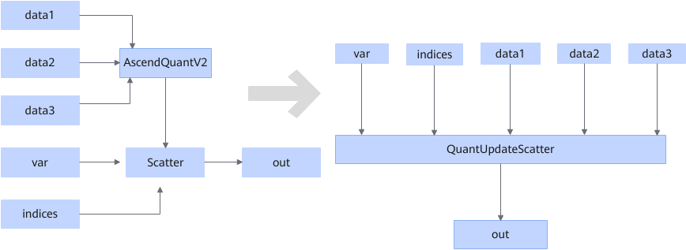

# AscendQuantV2ScatterFusionPass

## 融合模式

将满足如下Pattern的结构融合成QuantUpdateScatter算子。

## 使用约束

- AscendQuantV2输出只有一个，且给了Scatter节点，输出为int8、hifloat8、float8\_e5m2、float8\_e4m3fn数据类型。
- AscendQuantV2的属性sqrt\_mode为false，round\_mode为“round”，Scatter节点reduce属性为“update”。
- AscendQuantV2第三个输入存在时，数据类型必须为bfloat16。
- AscendQuantV2的input0必须为float16或者bfloat16，input1必须为bfloat16或者为float32。
- AscendQuantV2的input0和Scatter的var维度数保持一致，且axis轴的大小不大于var的axis轴的大小，其他轴大小保持一致，AscendQuantV2的input0的首轴大小等于Scatter的indices的首轴大小。
- AscendQuantV2的input1的总元素个数等于input0的最后一维的大小。input2输入如果存在，总元素个数等于input0的最后一维的大小。
- Scatter的indices维数只能是1维或者2维，如果是2维，其第2维的大小必须是2。
- Scatter的属性axis为-2。

## 支持的型号

<!-- npu="910b" id1 -->
Atlas A2 训练系列产品/Atlas A2 推理系列产品
<!-- end id1 -->

<!-- npu="950" id2 -->
Ascend 950PR/Ascend 950DT
<!-- end id2 -->
