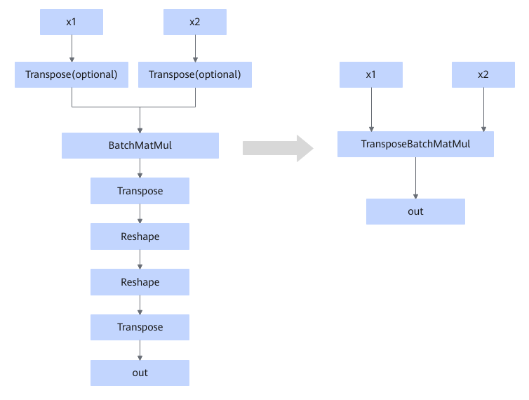

# BatchMatMul2TransposeBatchMatMulFusionPass

## 融合模式

**模式一：**

当Transpose（可选）、BatchMatMul、Transpose这几个节点按下图所示顺序连接时，可融合为TransposeBatchMatmul算子节点。

<!-- npu="A3,910b" id4 -->
如下融合模式支持的型号为：

<!-- npu="910b" id9 -->
- Atlas A2 训练系列产品/Atlas A2 推理系列产品
<!-- end id9 -->
<!-- npu="A3" id10 -->
- Atlas A3 训练系列产品/Atlas A3 推理系列产品
<!-- end id10 -->

<!-- end id4 -->

<!-- npu="950" id5 -->
Ascend 950PR/Ascend 950DT场景下，融合模式如下。

<!-- end id5 -->
**模式二：**

当BatchMatMul/BatchMatMulV2节点的x1输入shape为\[B2,B1,1,K\]， x2输入shape为\[1,B1,K,N\]/\[1,B1,N,K\]时，会插入reshape节点，将输入合轴为x1\[B2,B1,K\]，x2 \[B1,K,N\]/ \[B1,N,K\]，然后调用TransposeBatchMatMul节点，生成计算结果为\[B2,B1,N\]，再插入一个reshape节点，将输出的运算结果转化为\[B2,B1,1,N\]。

**模式三：**

当Transpose（可选）、Transpose（可选）、BatchMatMul、Transpose、Reshape、Reshape、Transpose这几个节点按下图所示顺序连接时，可融合为TransposeBatchMatmul算子节点。

## 使用约束

**模式一：**

- 输入x1、x2与输出out（输入与输出要对应）支持的数据类型：BFLOAT16，FLOAT16，FLOAT32。
- 输入输出支持的数据格式：ND。
  <!-- npu="A3,910b" id6 -->
- x1输入支持\[B, M, K\]或者\[M,B,K\]，x2输入只支持\[B, K, N\]，对应的TransposeBatchMatMul的属性为perm\_x1=\[0,1,2\]/\[1,0,2\]，perm\_x2=\[0,1,2\]。该约束仅适用于如下型号：  
  <!-- npu="910b" id7 -->
  - Atlas A2 训练系列产品/Atlas A2 推理系列产品
  <!-- end id7 -->
  <!-- npu="A3" id8 -->
  - Atlas A3 训练系列产品/Atlas A3 推理系列产品
  <!-- end id8 -->
  <!-- end id6 -->

  <!-- npu="950" id11 -->
- x1的输入为\[B, M, K\]或者\[M,B,K\]，x2的输入为\[B, K, N\]或者\[B, N ,K\]，对应的TransposeBatchMatMul的属性为perm\_x1=\[0,1,2\]/\[1,0,2\]，perm\_x2=\[0,1,2\]/\[0,2,1\]。该约束仅适用于如下型号：
  Ascend 950PR/Ascend 950DT

  <!-- end id11 -->
  
**模式二：**

- x1的输入为\[B2,B1,1,K\]，x2的输入为\[1,B1,K,N\] 或者 \[1,B1,N,K\]，对应的BatchMatmul的属性为adj\_x1=false，adj\_x2=false/true。
- 输入x1、x2与输出out（输入与输出要对应）支持的数据类型：FLOAT32。
- 输入输出支持的数据格式：ND。
  <!-- npu="A3,910b" id12 -->
- 该融合规则不支持开启HFLOAT32。该约束仅适用于如下型号：
  - Atlas A2 训练系列产品/Atlas A2 推理系列产品
  - Atlas A3 训练系列产品/Atlas A3 推理系列产品

- 输入需要满足B1\*K<65536。该约束仅适用于如下型号：
  - Atlas A2 训练系列产品/Atlas A2 推理系列产品
  - Atlas A3 训练系列产品/Atlas A3 推理系列产品

- 当输入数据类型为BFLOAT16，FLOAT16时，k和n向128对齐，需要满足B\*K<65536或者B\*K\>=65536，k<65536。该约束仅适用于如下型号：
  - Atlas A2 训练系列产品/Atlas A2 推理系列产品
  - Atlas A3 训练系列产品/Atlas A3 推理系列产品

- 当输入数据类型为FLOAT32且输入的transpose节点不为空时，无对齐限制，但仍需满足B\*K<65536。该约束仅适用于如下型号：
  - Atlas A2 训练系列产品/Atlas A2 推理系列产品
  - Atlas A3 训练系列产品/Atlas A3 推理系列产品

  <!-- end id12 -->
  
**模式三：**

- out的输出为\[B1,M,B/B1\*N\]，B%B1=0。
- 输入x1、x2与输出out（输入与输出要对应）支持的数据类型：BFLOAT16，FLOAT16，FLOAT32。
- 输入输出支持的数据格式：ND。
  <!-- npu="A3,910b" id13 -->
- x1输入支持\[B,M,K\]或者\[M,B,K\]，x2输入只支持\[B, K, N\]，对应的TransposeBatchMatMul的属性为perm\_x1=\[0,1,2\]/\[1,0,2\]，perm\_x2=\[0,1,2\]。该约束仅适用于如下型号：
  - Atlas A2 训练系列产品/Atlas A2 推理系列产品
  - Atlas A3 训练系列产品/Atlas A3 推理系列产品
  <!-- end id13 -->

    <!-- npu="950" id14 -->
- x1的输入为\[B,M,K\]或者\[M,B,K\]，x2的输入为\[B,K,N\]或者\[B,N,K\]，对应的TransposeBatchMatMul的属性为perm\_x1=\[0,1,2\]/\[1,0,2\]，perm\_x2=\[0,1,2\]/\[0,2,1\]。该约束仅适用于如下型号：

    Ascend 950PR/Ascend 950DT
    <!-- end id14 -->

- 当输入数据类型为BFLOAT16，FLOAT16时，k和n向128对齐，需要满足B\*K<65536或者B\*K\>=65536，k<65536。该约束仅适用于如下型号：
  - Atlas A2 训练系列产品/Atlas A2 推理系列产品
  - Atlas A3 训练系列产品/Atlas A3 推理系列产品

  <!-- npu="A3,910b" id15 -->
- 当输入数据类型为FLOAT32且输入的transpose节点不为空时，无对齐限制，但仍需满足B\*K<65536。该约束仅适用于如下型号：
  - Atlas A2 训练系列产品/Atlas A2 推理系列产品
  - Atlas A3 训练系列产品/Atlas A3 推理系列产品
  <!-- end id15 -->

## 支持的型号

<!-- npu="910b" id1 -->
Atlas A2 训练系列产品/Atlas A2 推理系列产品
<!-- end id1 -->

<!-- npu="A3" id2 -->
Atlas A3 训练系列产品/Atlas A3 推理系列产品
<!-- end id2 -->

<!-- npu="950" id3 -->
Ascend 950PR/Ascend 950DT
<!-- end id3 -->
