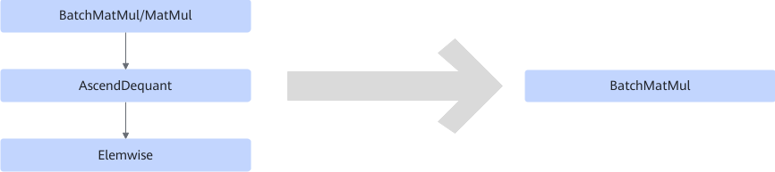

# BatchMatMulDequantElemwiseFusionPass

## 融合模式

量化场景，将BatchMatMul/MatMul +AscendDequant + Elemwise融合为BatchMatMul算子，Elemwise算子broadcast到MatMul上。

## 使用约束

- Elemwise的两输入维度需一致，且都存在batch轴。仅支持将Elemwise broadcast到MatMul的shape上，仅支持在batch轴进行broadcast。
- Elemwise仅支持Add和Sub算子。
- Elemwise的输入format须为FRACTAL\_NZ。

## 支持的型号

<!-- npu="310b" id1 -->
Atlas 200I/500 A2 推理产品
<!-- end id1 -->
