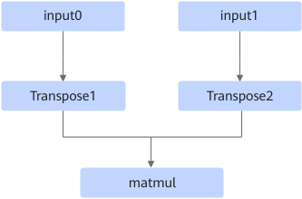
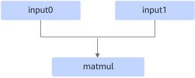

# BatchMatMulFusionPass

## 融合模式

有如下两种融合模式。

**模式一**：将满足如下Pattern关系的Transpose节点进行消除。

融合成

**模式二**：当BatchMatMul输入shape都是2维时，将BatchMatMul转换为MatMul，该融合规则默认关闭。

## 使用约束

模式一的约束如下：

- Transpose1和Transpose2可以同时存在，也可以只存在一个。
- Transpose类型包括Transpose和TransposeD。
- Transpose节点仅对输入的最后两维进行交换，如Transpose节点的输入shape为（batch, a, b）, 输出shape为（batch, b, a）。
- matmul类型包括BatchMatMul/BatchMatMulV2/MatMul/MatMulV2。
- matmul节点的输入dtype仅支持float16, float32和bfloat16。
