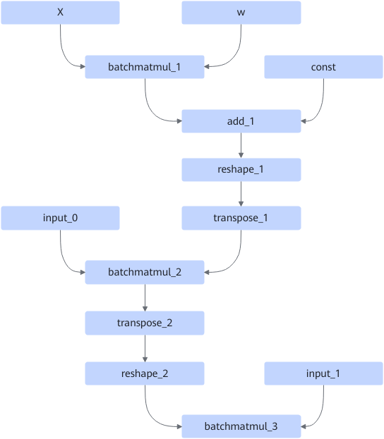
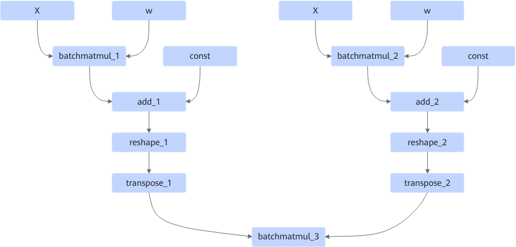
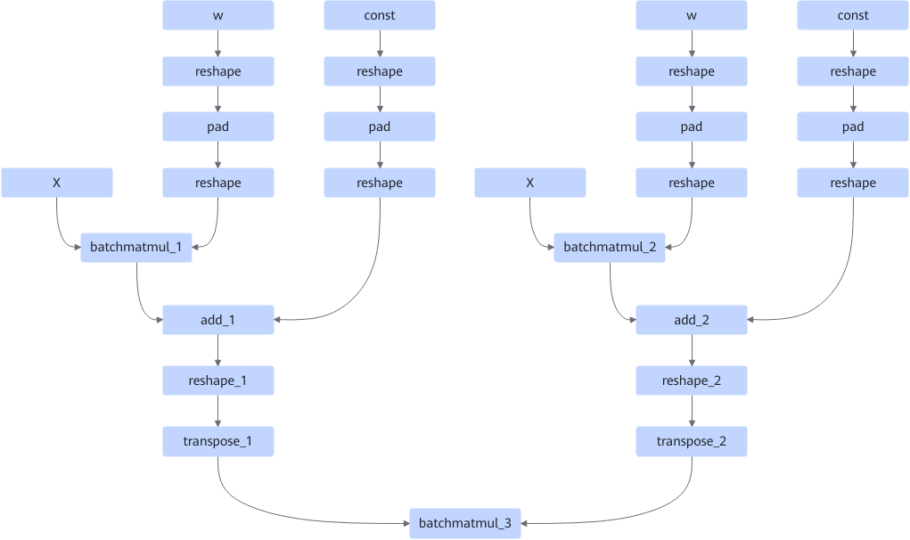

# BatchMatMulNonAlignedFusionPass

## 融合模式

该融合为BatchMatMul非对齐场景下的融合。

模式一：

融合成

模式二：

融合成

## 使用约束

BatchMatMul输入的M需要是16的倍数，输入的K不能是16的倍数。

transpose中perm值有如下约束：

1、不存在add\_2的情况，transpose.perm的值均为\{0,2,1,3\}

2、存在add\_2的情况，transpose\_1.perm的值是\{0,2,1,3\}，transpose\_2.perm的值是\{0,2,3,1\}
