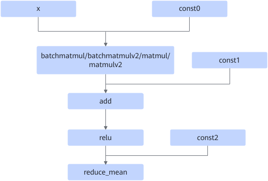

# BatchMatMulReduceMeanFusionPass

## 融合模式

为batchmatmul、batchmatmulv2、matmul、matmulv2和reducemean算子节点的常量输入添加pad算子节点，提高计算性能。

融合为

## 使用约束

- batchmatmul/batchmatmulv2/matmul/matmulv2节点的input1必须是一个const node。
- batchmatmul/batchmatmulv2/matmul/matmulv2节点的output矩阵\(m,n\)或\(b,m,n\)中m维必须16对齐，n维必须非16对齐。
- ReduceMean节点的必须有axes属性，且该节点reduce的不能是最后一根轴。
- add算子的const输入shape必须是1维的，且和matmul输出的n维保持一致。
