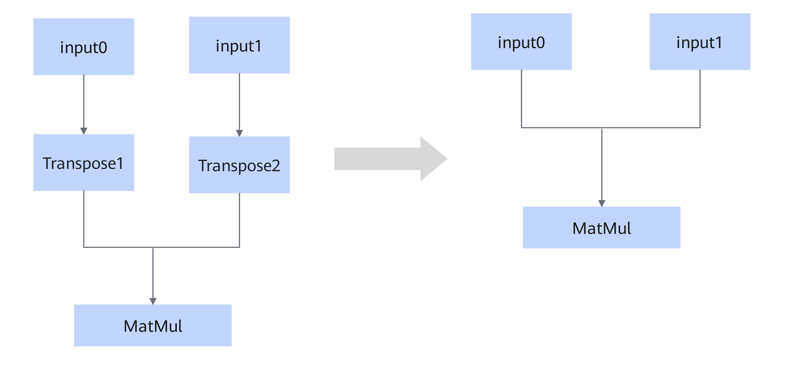

# BatchMatMulTransposeFusionPass

## 融合模式

该融合将符合图融合pattern的Transpose1/Transpose2算子融合。

## 使用约束

- Transpose1和Transpose2可以同时存在，也可以只存在一个。
- Transpose类型只包括Transpose。
- Transpose节点仅对输入的最后两维进行交换，如Transpose节点的输入shape为（batch, a, b）, 输出shape为（batch, b, a）。
- MatMul类型包括BatchMatMul/BatchMatMulV2/MatMul/MatMulV2。
- MatMul节点的输入dtype仅支持float16, float32和bfloat16。

## 支持的型号

<!-- npu="950" id1 -->
Ascend 950PR/Ascend 950DT
<!-- end id1 -->
