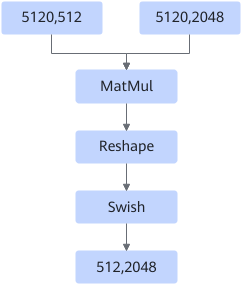
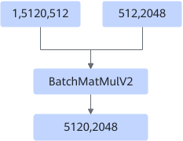
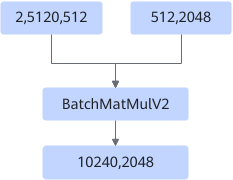

# BatchMatMulV2ReshapeFusionPass

## 融合模式

该融合模式分为三种场景：

场景一：针对MatMulV2+Reshape特殊场景，输出为四维并转置的场景，融合Transpose节点提升性能。Reshape节点的shape需满足\(m,n\)-\>\(m,1,tp,n/tp\)，其中tp为张量并行切分组数；Transpose节点的perm参数仅支持配置为\[0,2,1,3\]或\[0,2,3,1\]。

融合为

场景二：针对MatMul+Reshape+Swish融合场景，后置Reshape保证MatMul+Swish的融合。

融合为

场景三：非Atlas 推理系列产品，或是Atlas 推理系列产品中的白名单用例场景，支持3维\*2维BatchMatMulV2运算融合为2维 \* 2维MatMulV2运算，该场景分为动态或静态场景。

- 动态场景：

    

    融合为

    

- 静态场景：

    

    融合为

    

## 使用约束

- 融合节点为BatchMatmulV2、MatMulV2、MatMul的其中一种。
- 输入不支持INT4/INT8数据类型。
- 针对输入optype为BatchMatMulV2时，比如满足左矩阵为3维且右矩阵为2维。
- 针对输入optype为MatMulV2时，仅支持输入节点的左输入dtype为fp16。
- 动态场景下，仅支持左矩阵和右矩阵都不转置的情况。
- 静态场景下，要求左矩阵不转置，且不支持左右矩阵为NZ格式，当矩阵为3维\*2维时，不支持batch\*m \> max\(int64\)的大小。
- 静态场景下，针对BatchMatMulV2后接Add/Relu/AddN/Mul算子场景，Batch维度需大于50， M维度需小于32，或者M=1，Batch维度大于1时，图融合规则生效。
- 静态场景下，针对单BatchMatMulV2大Batch场景，Batch维度需大于4096， M维度需小于64，或者M=1，Batch维度大于1时，图融合规则生效。
<!-- npu="310p" id6 -->
- Atlas 推理系列产品中，仅在白名单用例下，该图融合规则生效。
<!-- end id6 -->

## 支持的型号

<!-- npu="310p" id1 -->
Atlas 推理系列产品
<!-- end id1 -->

<!-- npu="310b" id2 -->
Atlas 200I/500 A2 推理产品
<!-- end id2 -->

<!-- npu="910" id3 -->
Atlas 训练系列产品
<!-- end id3 -->

<!-- npu="910b" id4 -->
Atlas A2 训练系列产品/Atlas A2 推理系列产品
<!-- end id4 -->

<!-- npu="A3" id5 -->
Atlas A3 训练系列产品/Atlas A3 推理系列产品
<!-- end id5 -->
