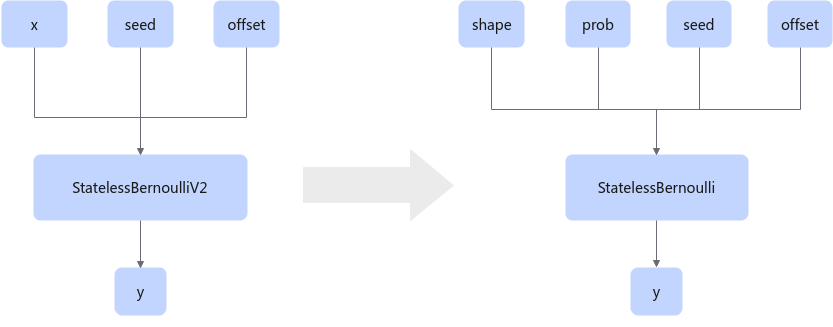

# BernoulliFusionPass

## 融合模式

在GE中对于prob是多个值的场景，将StatelessBernoulliV2中x的shape关联到StatelessBernoulli第一个输入shape，x的value关联到第二输入prob中，形成统一在线编译的适配能力。

## 使用约束

StatelessBernoulliV2和StatelessBernoulli算子节点和描述非空。

StatelessBernoulliV2输入维度 \>= 2。

## 支持的型号

<!-- npu="950" id1 -->
Ascend 950PR/Ascend 950DT
<!-- end id1 -->
