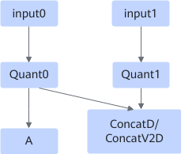
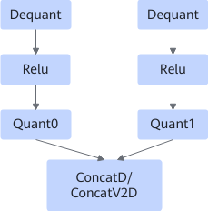
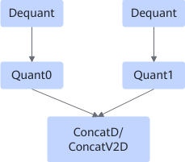

# ConcatQuantFusionPass

## 融合模式

该融合规则将ConcatD/ConcatV2D+Quant子图融合成Quant+ConcatD/ConcatV2D子图模式。该融合规则可以减少数据搬运量，提高计算性能。

融合成

或者

融合成

或者

融合成

## 使用约束

- 图一场景下，Quant0和Quant1的参数需要保持一致。
- 在数据比对时需要关闭对应融合规则。
- 当前Quant输出dtype为int4时不支持该融合规则。
- Concat的输出节点不支持stridedwrite算子。
- 支持Fixpipe的场景下，Relu可以是LeakyRelu、Prelu、Relu6、Relu。
<!-- npu="910b,910,310p,310b" id1 -->
- 当Concat输入格式为NCHW且concat\_dim\_为1或者-3，或者Concat输入格式为NHWC且concat\_dim\_为3或者-1时，即合并轴为C轴，C轴的值需要为K0值的整数倍。shape值需要满足如下条件。

    数据类型为默认的Float16或者Float32时，K0=16；数据类型为int8时，K0=32；数据类型为int4时，K0=64。该约束条件适用于如下芯片类型。

    <!-- npu="910" id2 -->
    - Atlas 训练系列产品
    <!-- end id2 -->
    <!-- npu="310p" id3 -->
    - Atlas 推理系列产品
    <!-- end id3 -->
    <!-- npu="910b" id4 -->
    - Atlas A2 训练系列产品/Atlas A2 推理系列产品
    <!-- end id4 -->
    <!-- npu="310b" id5 -->
    - Atlas 200I/500 A2 推理产品
    <!-- end id5 -->
<!-- end id1 -->
