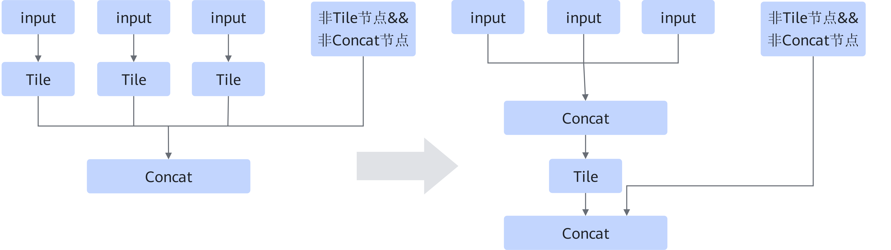

# ConcatTileFusionPass

## 融合模式

该融合将连续具备相同Multiple的Tile算子的输入使用Concat进行连接，进而完成Tile算子的融合，如下图所示。

**模式一**

**模式二**

## 使用约束

- 仅支持Tile/TileD+Concat类算子。
- Concat\[ConcatD/ConcatV2/ConcatV2D\]，Tile/TileD只能是单输出。
- Concat的concat\_dim与Tile/TileD的广播轴不能是同一根轴。
- Concat仅支持含数据边，控制边只允许存在于Tile节点的输入。
- 仅支持静态场景。
- Tile/TileD的输入Multiple必须相同，在Concat的输入上表现连续性，Tile/TileD连续的数量必须大于2。
- Tile/TileD的输入张量的形状维度的乘积必须小于等于shape\_limited\_。

    shape\_limited\_ = vector\_calculate\_size \* 2 \* vector\_core\_num/data\_type\_size 。

    其中，data\_type\_size=Concat\[ConcatD/ConcatV2/ConcatV2D\]的输出张量的数据类型对应的数据大小。

    vector\_calculate\_size和vector\_core\_num的查看方法如下。

    查看“$\{INSTALL\_DIR\}/$\{arch\}/data/platform\_config”文件夹中的相应平台信息文件，分别搜索关键字“vec\_calc\_size”或“vector\_core\_cnt”以获取vector\_calculate\_size和vector\_core\_num的值。$\{INSTALL\_DIR\}请替换为CANN软件安装后文件存储路径。以root用户安装为例，安装后文件默认存储路径为：/usr/local/Ascend/cann。

## 支持的型号

<!-- npu="310p" id1 -->
Atlas 推理系列产品
<!-- end id1 -->

<!-- npu="310b" id2 -->
Atlas 200I/500 A2 推理产品
<!-- end id2 -->

<!-- npu="910" id3 -->
Atlas 训练系列产品
<!-- end id3 -->

<!-- npu="910b" id4 -->
Atlas A2 训练系列产品/Atlas A2 推理系列产品
<!-- end id4 -->

<!-- npu="A3" id5 -->
Atlas A3 训练系列产品/Atlas A3 推理系列产品
<!-- end id5 -->
