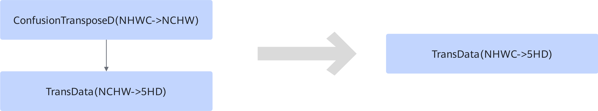

# ConfusionTransposeTransDataFusionPass 

## 融合模式

在图融合阶段将ConfusionTransposeD\(NHWC-\>NCHW\)+TransData\(NCHW-\>5HD\)融合为TransData\(NHWC-\>5HD\)算子，减少一次ConfusionTransposeD操作。

## 使用约束

- 仅支持静态子图。
- 仅支持ConfusionTransposeD\(NHWC-\>NCHW\) + TransData\(NCHW-\>5HD\)场景。
