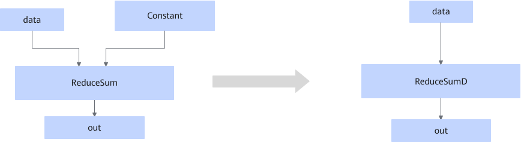

# ConstToAttrReduceSumFusion

## 融合模式

静态场景下，该融合将符合图融合pattern的ReduceSum算子修改为ReduceSumD算子。

## 使用约束

- 输入的数据类型仅支持float16、float32和bfloat16。
- 当轴是空tensor时，该融合规则不生效。
- 动态场景下，该融合规则不生效。
- 该融合规则默认开启且不能关闭。

## 支持的型号

<!-- npu="910b" id1 -->
Atlas A2 训练系列产品/Atlas A2 推理系列产品
<!-- end id1 -->
