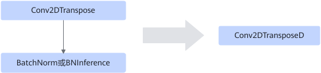

# Conv2DTransposeBatchnormFusionPass

## 融合模式

该融合规则将Conv2DTranspose+BatchNorm或BNInference算子融合为Conv2DTransposeD算子，将BatchNorm或BNInference的输入转化为Conv2DTransposeD的weight和bias输入。

## 使用约束

- Conv2DTranspose的属性groups必须等于1。
- BatchNorm或BNInference的输入类型（除输入x之外）必须是const类型。
- 仅支持静态场景。
- BatchNorm的算子维度仅支持4维。
